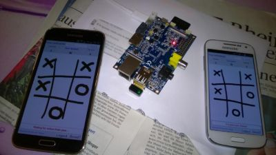

libSolomon - version 4.0 - SSL/TLS connection support
=======

  
Cross-platform network framework library to implement client/server or peer-to-peer architectures.

Add astonishing and professional functionalities to your mobile/desktop applications easily.
Just create your own logical protocol and objects and you are ready with your software!
Thanks to its nature, you can have real-time, critical-mission server/client like: chat server, notification systems, multicast, betting or financial systems, every kind of applications like Evernote, whatsapp, distribuited games and so on...

<b>--- Binaries are distributed for FREE and without any LIMITATION ---</b>

Supported systems:

* client: <b>Windows, Linux, MacOSX, Raspberry, Android, iOS, Blackberry10</b>
* server: <b>Linux, Raspberry 2</b>

It provides a professional server with advanced features like:

* Able to serve UDP and TCP requests in parallel within one instance
* Low-memory footprint and optimized usage of memory
* Real-time requests' elaboration using parallel thread pools and queues
* High availability and reactivity using event-driven pattern.
* High security and stability provided by decoupling the engine core from customized protocol-related executions using a full modular pattern implementation.
* Advanced garbage collector with a minimal impact on the server load
* Notification-driven pattern to interact with requests and get actions
* Integrity checks performed on requests avoiding useless cpu-time and memory consumption
* Memory-slot support to reduce I/O from a storage available for both UDP and TCP
* File Upload capability 
* (<b>NEW</b>) Enable/Disable TLS support for server/client nodes
* Support for temporary or permanent connections
* Support for hot-load plugins (add/replace/remove commands) without restarting a server
* Cluster support communication over UDP
* A full open-source plug-in to load default settings at start-up (the provided one implements mysql support and xml-based settings)

It provides a professional embedded server (on client side) with these features:

* Embedded server on TCP protocol
* Able to send UDP and TCP requests
* Asynchronous and synchronous requests
* File upload capability

Examples of working client/server Solomon-enabled application:
 
Mobile Softair (Android, iPhone, Nokia n9, Symbian ^3, Blackberry): http://www.softairrealfight.net
 
Mobile Android shake and chat: http://www.softairrealfight.net/transfer/bubblesChat.apk
  
Qt tic-tac-toe modified for online game (available source-code for both client and server):
 
android: http://softairrealfight.net/transfer/tictactoe.apk
 
win7 64bit: http://softairrealfight.net/transfer/ticTacToe.zip

